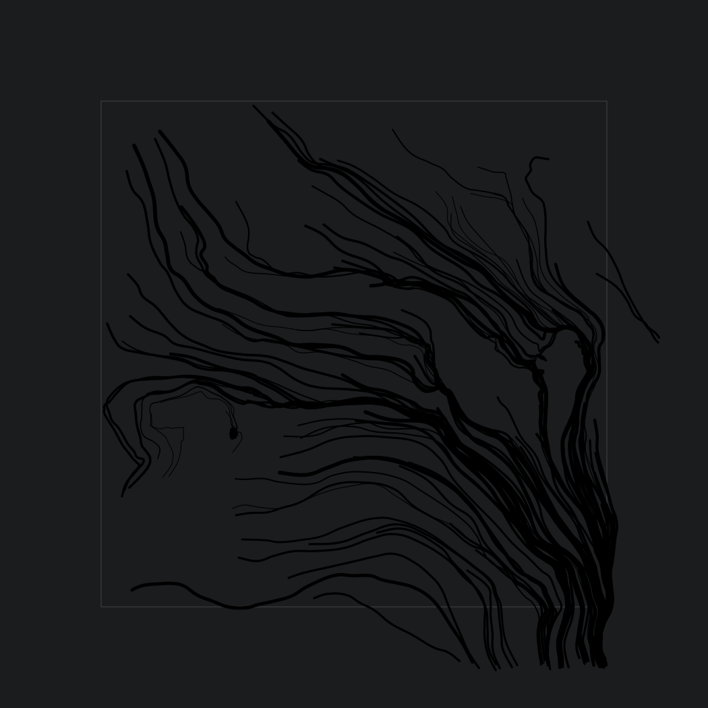

# Neon

Generative art piece made using 2d vector field. You can read how it works in [this blog post](https://muffinman.io/neon-generative-art-piece-made-using-2d-vector-field/).

[https://neon.muffinman.io/](https://neon.muffinman.io/)

All generated images have unique URL you can easily share.

If you end up using Neon, please let me know, I would love to see it in the wild. Just open an issue with what you did with it.

## Example image

[](https://neon.muffinman.io//#/false/15/15/50/50/110/5/k554ri7kipa/32fmz98huj9/qunuqveb03)

## Running it locally

You'll need to have node and npm installed.

I used node 12, and project is built using node 10 on netlify.

* Install dependencies
  ```
  npm install
  ```
* Run local server
  ```
  npm start
  ```

  Visit [http://localhost:1234](localhost:1234)
